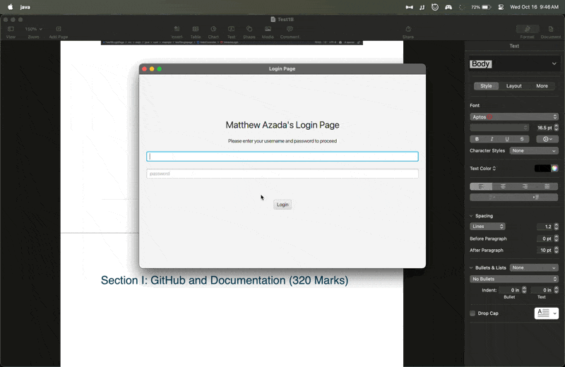
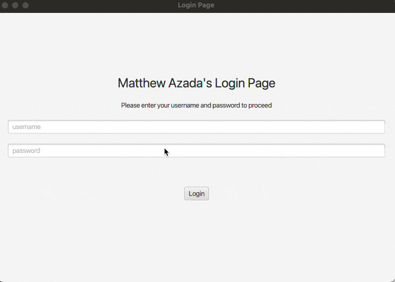

# Features

- **Login Validation**: Ensures that the user inputs both username and password.
- **Authentication**: Checks the entered credentials against a predefined set of users.
- **User Lock-Out**: Locks the user out after three failed login attempts.

# Project Modules

- **Main Application**: Located in `src/main/java/com/example/test1bloginpage/`
  - `Main.java`: The entry point of the application.
  - `LoginController.java`: Handles the login logic and user interactions.
  - `User.java`: Represents a user with username and password.
- **Resources**: Located in `src/main/resources/com/example/test1bloginpage/`
  - `login-view.fxml`: The FXML file for the login GUI designed using Scene Builder.

